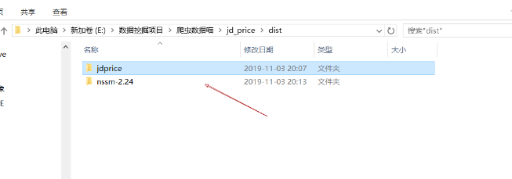
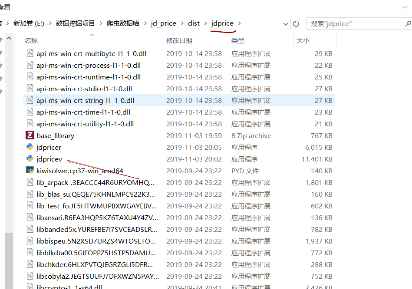
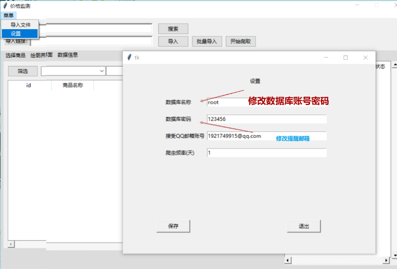
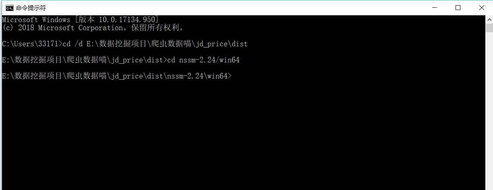
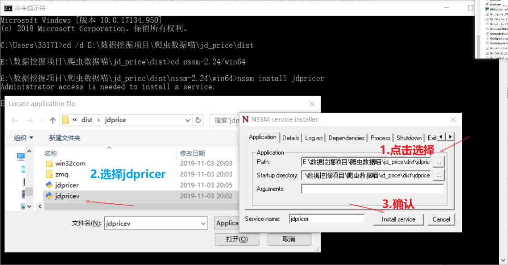
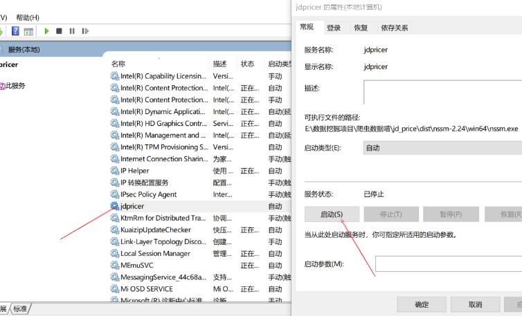

### 一、工具内容

1. jdpricev：价可视化工具
2. jdpricer：后台服务


### 二、工具安装步骤

#### 2.1 [安装Mysql数据库](https://zhuanlan.zhihu.com/p/37152572)

#### 2.1 配置

​	一是在可视化工具填写**数据库账号密码**(重要！！！)，二是将jdpricer（后台）注册进服务。步骤如下：


1. 进入文件安装目录，打开**jdprice**目录



2. 在jdprice目录中找到**jdpricev**应用程序，打开



3. 修改数据库账号密码，点击保存，退出软件

   

4. 打开黑窗口（命令行），切换到安装目录

```python
打开命令行
	1.键盘按Win+R
	2.输入：cmd
	3.确认
切换到安装目录
cd /d 安装目录		#例如  CD /d E:\数据挖掘项目\爬虫数据喵\jd_price\dist\jdprice
```

5. 切换到“nssm-2.24/win64”目录，（如果电脑是32位，则“nssm-2.24/win32”）

```python
cd nssm-2.24/win64
```



6. 安装后台服务：

```python
nssm install jdpricer
```

7. 选择安装**jdpricer**并确认



8. 打开服务，找到**jdpricer**，启动

```python 
打开服务
    1.键盘按Win+R
	2.输入：services.msc
	3.确认
```



```python
	1.键盘按Win+R
	2.输入：services.msc
	3.确认
```

8. 