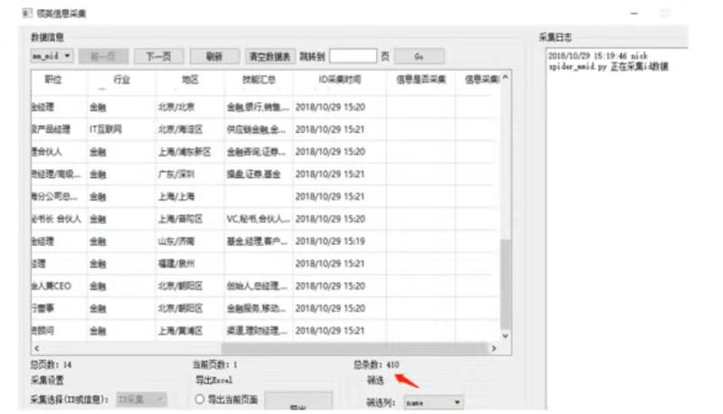

# 京东商品价格监测

## 目的

1. 快速了解特定商品价格变动，可批量导入
2. 存入历史价格
3. 历史价格可导出excel做分析

### 功能

+ 无界面
  1. 价格变动提示：定时监测商品价格信息。若价格变动，在界面提示（高级尝试邮箱提示）

+ 有界面
  1. 数据管理模块
     1. 添加：批量导入商品的链接（按钮）
     2. 删除：批量删除商品的链接、历史数据（按钮、多选）
     3. 导出：批量导出商品的历史价格信息到excel（多选，按钮）
  2. 数据展示模块
     1. 指定商品的历史价格信息显示（表格，指定页数/日期）
     2. 价格变动日志（文本框，显示价格变动的商品；高级尝试画图）
  3. 设置模块
     1. 设置商品的日常售价
     2. 设置提醒邮箱
     3. 设置定时监测的频率（每周一次或者每天）

参考模板：

